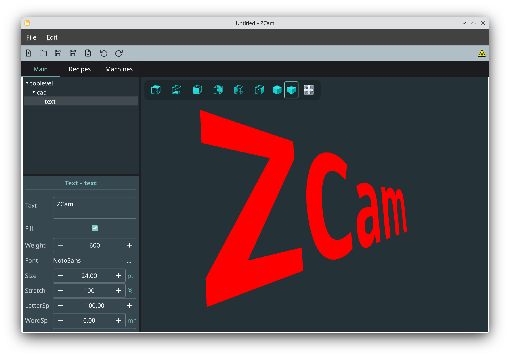
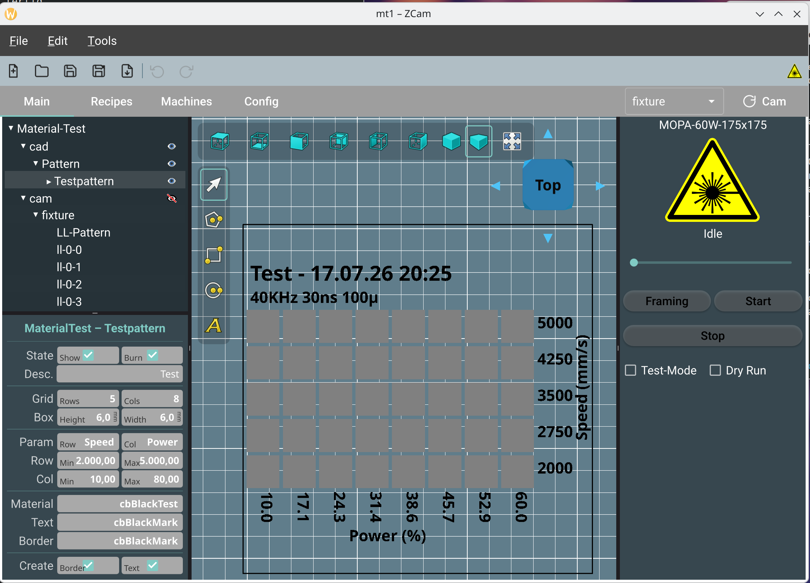

# ZCam

ZCam ist ein CAM-Programm (Computer Aided Manufacturing). Du kannst damit
CAD-Daten importieren und bearbeiten. ZCam generiert daraus Steuerdaten für
Galvo-Faserlaser oder G-Code für CNC-Maschinen.

ZCam ist in aktiver Entwicklung und macht schnelle Fortschritte. Ich teste die
aktuelle Version mit einem 60W MOPA Faserlaser.

- [Build](manual/build.md)
- [Handbuch](manual/manual-de.md)
- [Installation](manual/install-de.md)
- [Entwicklung](manual/development-de.md)

### Third-Party-Code
Zur Bequemlichkeit enthält ZCam einige Third-Party-Quellen:

- clipper2 von Angus Johnson; Lizenz: https://www.boost.org/LICENSE_1_0.txt
- tess2 von Mikko Mononen; Lizenz: SGI FREE SOFTWARE LICENSE B (Version 2.0, Sept. 18, 2008)
