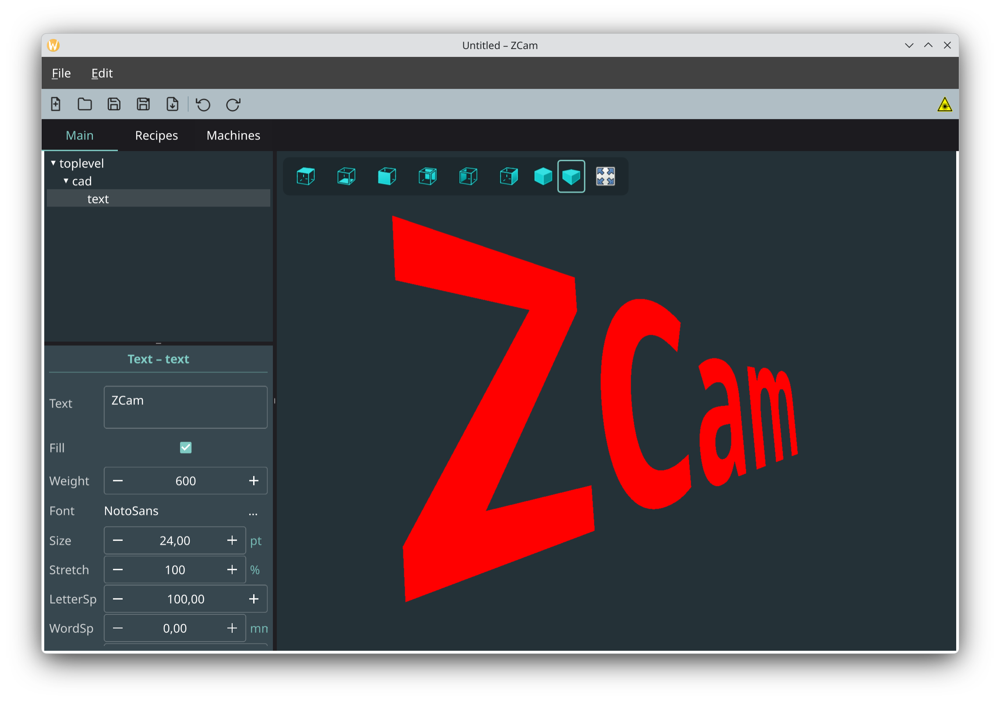
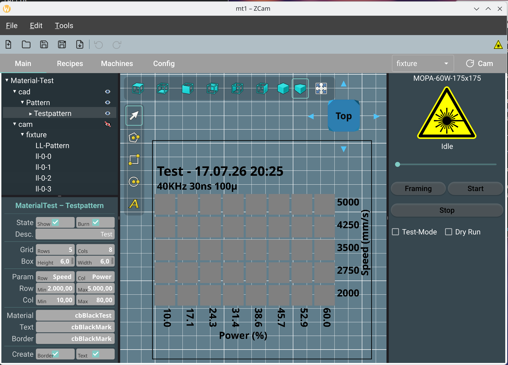

# ZCam

ZCam is a CAM (Computer Aided Manufacturing) program. It allows you to import and edit CAD data. ZCam generates control data for Galvo fiber lasers or G-code for CNC machines.

ZCam is under development and makes fast progress. I am testing the current
version with a 60W MOPA Fiber Laser.

- [Build](manual/build.md)
- [Manual](manual/manual.md)

### Thirdparty Code
For convenience, ZCam includes some third-party sources:

- clipper2 from Angus Johnson; License: https://www.boost.org/LICENSE_1_0.txt
- tess2 from Mikko Mononen; License: SGI FREE SOFTWARE LICENSE B (Version 2.0, Sept. 18, 2008)
