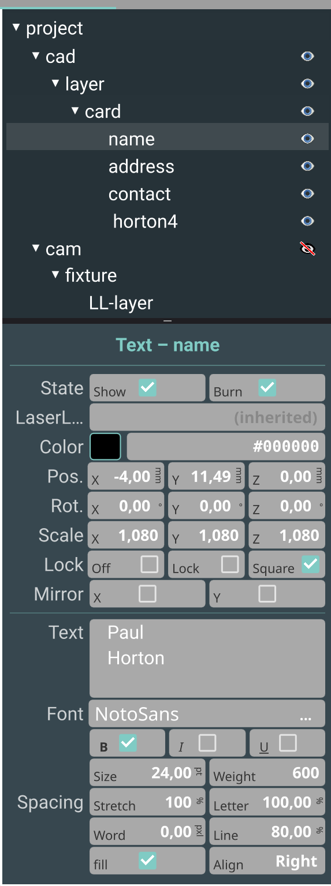
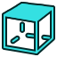
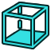
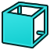
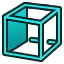
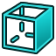
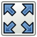

---

<span style="font-size:48px">ZCam — User Manual</span>

---

[TOC]

- [Development](#development)
- [Installation](#installation)

---

# Overview

ZCam is a CAM (Computer Aided Manufacturing) program. It allows you to import and
edit CAD data (DXF, SVG). ZCam generates control data for Galvo fiber lasers or
G-code for CNC machines.

The application is built with C++23, Qt 6, QML, and Qt Quick 3D. The main window is
a 3D canvas; the bulk of the logic is in C++, with QML driving the UI.

---

# GUI

## Overview

The GUI consists of several panels that you can switch between via buttons in the
panel bar.

| Panel | Description |
| :--- | :--- |
| **Main** | The main work surface — project tree, inspector, and 3D viewport. |
| **Recipes** | Archive of laser recipes (parameter sets for different engraving tasks). |
| **Machines** | Configure your machine(s) — laser or G-code CNC. |
| **Config** | Application-wide settings (GUI, colors, directories, etc.). |
| **Laser** | Side panel for laser control (init/exit, framing, marking, test mode). |
| **Media Browser** | Browse artwork (SVG icons, fonts) for import into the project. |

### Menu Bar

| Menu | Items |
| :--- | :--- |
| **File** | New, Open, Save, Save As, Import, Quit |
| **Edit** | Undo, Redo, Configure (switches to Config tab) |
| **Tools** | Material Test, Galvo Test |
| **Help** | About |

### Toolbar

The toolbar provides quick-access buttons for the most common file operations
(New, Open, Save, Save As, Import), Undo/Redo, Media Browser toggle, and Laser
Panel toggle.

### Tab Bar

The tab bar switches between the four main panels: **Main**, **Recipes**,
**Machines**, and **Config**.

To the right of the tab bar you find:

- **Fixture selector** — a combo box to choose the active fixture for CAM
  processing.
- **Cam button** — recalculates CAM data. The button is only enabled when CAM data
  is dirty (i.e. after geometry changes that have not yet been processed).

### Status Bar

The status bar at the bottom of the window shows messages and the current mouse
position in the 3D viewport.

---

## The `Main` Panel

The Main panel is horizontally split into sub-panels, some of which can be
optionally shown/hidden.

<div style="display: flex; align-items: center;">
  <div style="flex: 1; padding-right: 20px;">
    
  </div>
  <div style="flex: 2;">

- **Project** — This panel is vertically divided into the **Project Tree** and the
  **Inspector**.

**Project Tree** shows a hierarchical view of the project elements. In the upper
half you find CAD elements that represent the input of the CAM processor. Below,
you see CAM elements that process the CAD input and produce the output for the
**Machine**.

**Inspector** shows the properties of the currently selected project element.

  </div>
</div>

### Project Tree

The project tree displays the full element hierarchy:

```
Project
├── Camera
├── Cad
│   ├── Group (Layer 1)
│   │   ├── Rectangle
│   │   ├── Polygon
│   │   ├── Ellipse
│   │   └── Text
│   └── Group (Layer 2)
├── Cam
│   └── (CAM output elements)
├── Fixture 1
│   └── Framing
├── Fixture 2
│   └── Framing
└── ...
```

- **Click** to select an element.
- **Double-click** a group/layer to rename it.
- **Drag & drop** elements to reparent them.
- The expand/collapse state is persisted across sessions.

### Element Hierarchy and Groups

#### Tree Structure

All project elements are organised in a single tree rooted at the `Project`
element. The tree has a fixed top-level structure:

```
Project
├── Camera         (optional, camera-assisted positioning)
├── Cad             (CAD input — contains all drawing geometry)
│   ├── Group       (a CAD layer, also called "layer" or "group")
│   │   ├── Rectangle
│   │   ├── Polygon
│   │   ├── Ellipse
│   │   └── Text
│   └── Group
├── Cam             (CAM output — computed from CAD + Recipes)
├── Fixture 1       (a fixture with a framing contour)
│   ├── Framing
│   └── Recipe      (LaserLayer — assigns laser parameters to CAD elements)
├── Fixture 2
│   ├── Framing
│   └── Recipe
└── ...
```

**Key rules:**

- **Cad** is the container for all CAD input geometry. It has one or more **Groups**
  (layers), each containing shapes (Rectangle, Polygon, Ellipse, Text).
- **Cam** is the container for CAM output. It is automatically computed from the
  CAD geometry and the Recipe/LaserLayer assignments.
- **Fixture** elements live under Cam. Each fixture has a **Framing** sub-element
  (the framing contour) and one or more **Recipe** sub-elements (LaserLayers).
- **Recipe** elements (LaserLayers) assign laser parameters to CAD geometry. They
  are children of Fixtures.

#### Creating Groups

Groups (layers) can be created in two ways:

1. **Context menu**: Right-click on the **Cad** element in the project tree and
   select **Add Group**. A new Group is created as a child of Cad.
2. **Drag & drop reparenting**: Any element can be made a child of another element
   by dragging it onto the target in the project tree (see below).

Every Element3d can have children — not just Groups. A Rectangle, Polygon, or Text
element can also have child elements, forming a sub-group. This means any shape
can act as a group parent.

#### Coordinate System

ZCam uses a **hierarchical local coordinate system**. Each Element3d has its own
local coordinate space defined by three properties:

| Property | Type | Description |
| :--- | :--- | :--- |
| **pos** | `QVector3D` | Position (x, y, z) in the parent's coordinate system (mm) |
| **rot** | `QVector3D` | Rotation around x, y, z axes (degrees) |
| **scale** | `QVector3D` | Scale factor per axis |

The **local transform matrix** of an element is:

```
M_local = Translate(pos) × Rotate(rot) × Scale(scale)
```

The **global (world) transform** is the product of all parent matrices from the
root down to this element:

```
M_global = M_root × ... × M_parent × M_local
```

A point in an element's local space is transformed to world space by:

```
P_world = M_global × P_local
```

**Key points:**

- The origin (0, 0, 0) is at the lower-left corner of the work area.
- All coordinates are in millimetres.
- The coordinate system is purely positive (all geometry should have positive
  coordinates within the scan field).
- Mirror properties (`mirrorX`, `mirrorY`) are applied as negative scale values
  in the local matrix.
- When an element is reparented, its local pos/rot/scale are **automatically
  recalculated** so that the world-space position stays the same (no visual jump).
  The formula is: `M_new_local = inverse(M_new_parent_global) × M_old_global`.

#### Moving Element Groups

Since each element has its own local coordinate system within its parent, moving
a **parent group** automatically moves all its children. This is because the
children's world positions are computed by multiplying through the parent's
transform matrix.

- **Drag a group** in the 3D viewport → all children move together.
- **Change the pos property** of a group in the Inspector → all children move
  together.
- **Rotate or scale a group** → all children rotate or scale around the group's
  origin.
- **Mirror a group** (`mirrorX`/`mirrorY`) → all children are mirrored.

This hierarchical transform means you can build complex layouts by nesting groups.
For example, you can create a logo as a group of shapes, then position, rotate,
and scale the entire logo as a single unit.

### CAD-to-Recipe Assignment

The association between CAD geometry and laser parameters (Recipes/LaserLayers)
is managed through the **`laserLayer` property** on each Element3d:

#### How It Works

1. Each **Recipe** element (LaserLayer) is a child of a Fixture and references a
   **LaserRecipe** (a named parameter set from the Recipes panel).
2. Each Element3d in the CAD tree has a `laserLayer` property that can reference
   a Recipe element.
3. If an element's `laserLayer` is null, it **inherits** the laserLayer from its
   parent. This is determined by `effectiveLaserLayer()`, which walks up the
   parent chain until a non-null `laserLayer` is found.
4. During CAM processing, the Recipe collects all CAD elements whose
   `effectiveLaserLayer()` matches itself, and processes them with its laser
   parameters.

#### Assignment Workflow

1. Create a **Fixture** (right-click Cam → Add Fixture).
2. Create a **LaserLayer** (Recipe) under the Fixture (right-click Fixture → Add
   Laserlayer).
3. Select a LaserRecipe for the LaserLayer (in the Inspector, the "Recipe"
   property).
4. Select a CAD element or Group and set its **"Recipe"** (laserLayer) property in
   the Inspector to the LaserLayer.
5. All children of that element that don't have their own laserLayer set will
   inherit it automatically.

#### Example

```
Fixture "Engrave"
├── Framing
└── Recipe "Deep Engrave"  (recipe: "50W slow deep")

Cad
├── Group "Logo"           (laserLayer: → "Deep Engrave")
│   ├── Rectangle           (inherits "Deep Engrave")
│   ├── Polygon             (inherits "Deep Engrave")
│   └── Group "Details"     (inherits "Deep Engrave")
│       ├── Text            (inherits "Deep Engrave")
│       └── Ellipse         (inherits "Deep Engrave")
└── Group "Border"         (laserLayer: → "Light Mark")
    └── Polygon             (inherits "Light Mark")
```

In this example, all elements under "Logo" use the "Deep Engrave" parameters,
while elements under "Border" use "Light Mark". An element can override the
inherited laserLayer by setting its own `laserLayer` property.

### Drag & Drop in the 3D Viewport

#### Moving Elements

To move an element in the 3D viewport:

1. **Click** on an element to select it. The element's bounding box appears with
   drag handles.
2. **Click and drag** inside the bounding box to move the element. The element
   follows the mouse on the XY plane.
3. **Release** the mouse button to drop the element at the new position.

The drag is constrained to the XY plane (the laser work surface). The movement is
recorded as an undoable command when the drag ends (`endElementDrag()`).

- **Groups**: Clicking inside a group's bounding box selects and drags the entire
  group (including all children). The group acts as a single draggable unit.
- **Vertex editing**: When a Polygon is selected, individual vertex handles
  appear. Dragging a vertex handle moves only that vertex (not the whole element).
- **`Ctrl` + Mouse wheel**: Scales the selected element.
- **`Shift` + Mouse wheel**: Scales uniformly (maintains aspect ratio).

#### Drag & Drop Reparenting (Project Tree)

Elements can be re-organised in the project tree via drag & drop:

| Drop Position | Visual Indicator | Action |
| :--- | :--- | :--- |
| **Top third** of a row | Blue line at top | Insert **before** the target (reorder within same parent) |
| **Middle third** of a row | Highlighted row | Drop **into** the target (reparent as child) |
| **Bottom third** of a row | Blue line at bottom | Insert **after** the target (reorder within same parent) |

- **Dropping onto a Group** makes the dragged element a child of that Group. The
  element's local pos/rot/scale are recalculated to preserve its world position.
- **Dropping onto a Shape** (Rectangle, Polygon, etc.) makes the dragged element a
  child of that shape, forming a sub-group.
- **Dropping onto a Container** (Cad, Cam, Fixture) inserts the element as the
  last child.
- **Reordering**: Dropping before/after a row reorders the element within the
  same parent.
- Self-drop and dropping into a descendant are prevented.

All drag & drop operations in the tree are undoable.

### Media Browser

The Media Browser is a toggleable side panel (button "M" in the toolbar) with
three sub-panels:

#### Fonts Panel

Browse and apply system fonts to Text elements:

1. **Select a Text element** in the project tree or 3D viewport.
2. **Open the Media Browser** (click the "M" button in the toolbar) and switch to
   the **Fonts** tab.
3. Browse the font list (toggle between All fonts and Favorites with the
   "All"/"Favs" buttons).
4. Click a font family to select it. The right side shows a live preview with the
   selected font and style.
5. Adjust the **style** (Regular, Bold, Italic, etc.) from the dropdown.
6. Edit the **sample text** to preview different text.
7. **`Ctrl` + Mouse wheel** in the preview area to scale the preview font size.
8. Click **Apply** to apply the selected font to the current Text element. The
   change is undoable via the undo stack.
9. Alternatively, use the **font picker** in the Inspector (the "font" property
   type shows a FontFamilyButton that opens the Media Browser Fonts panel
   automatically and pre-selects the current font).
10. Click the ★/☆ button to add/remove a font from your Favorites.

#### Artwork Panel

Browse SVG/DXF/DWG artwork from a configured directory and drag it onto the 3D
canvas:

1. Configure the **Artwork Directory** in the Config panel (Config → Directories →
   Artwork Directory). The directory tree appears on the left side of the Artwork
   panel.
2. Navigate the directory tree and select a folder. Supported files (`.svg`,
   `.dxf`, `.dwg`) appear as thumbnail tiles on the right.
3. **Click** a tile to select it.
4. **Drag** a tile from the panel onto the 3D viewport. A green bounding-box
   preview follows the mouse cursor on the XY plane.
5. **Release** the mouse to import the file at the cursor position. The SVG/DXF
   geometry is created as Polygon elements in the current visible CAD layer,
   positioned so the bottom-left corner of the imported bounding box is at the
   drop position.

The artwork tiles can be scaled with `Ctrl` + Mouse wheel for better visibility.

#### Icons Panel

Browse SVG icons from the configured icon directory. This panel is primarily used
for reference and can also be used to drag SVG icons onto the canvas.

### Drag & Drop Import onto the 3D Canvas

ZCam supports two methods of importing SVG/DXF/DWG files onto the 3D canvas:

#### Method 1: From the File System (Desktop Drag & Drop)

1. Drag a `.svg`, `.dxf`, or `.dwg` file from your file manager (e.g. Dolphin,
   Nautilus) directly onto the 3D viewport.
2. A **teal-coloured overlay** appears with the text "Drop SVG / DXF to import",
   and a green bounding-box preview follows the mouse cursor.
3. **Release** the mouse to import the file at the cursor position. The geometry
   is placed so the bottom-left corner of its bounding box is at the drop point.

#### Method 2: From the Media Browser Artwork Panel

1. Open the Media Browser and switch to the **Artwork** tab.
2. Navigate to the folder containing your SVG/DXF files.
3. **Drag** an artwork tile onto the 3D viewport.
4. The same preview and drop behaviour as Method 1 applies.

#### How It Works Internally

- **`startSvgDrag(path)` / `startDxfDrag(path)`**: Parses the file, computes its
  bounding box, and creates a `TessGeometry` rectangle outline as a preview. The
  QML layer positions this preview at the cursor position on the XY plane.
- **`importSvgAt(path, x, y)` / `importDxfAt(path, x, y)`**: Imports the file and
  positions the geometry so the bottom-left corner of the bounding box is at
  (x, y) in scene coordinates.
- **`endSvgDrag()`**: Cleans up the preview geometry.
- The `DropArea` QML component handles the drag-entered, position-changed, and
  dropped events, converting screen coordinates to scene coordinates via
  `screenToScene()`.


### Inspector

The Inspector displays the properties of the selected element. Properties are
arranged in rows, each with a label and one or more cells (sub-properties). The
property types include:

| Type | Description |
| :--- | :--- |
| `text` | Text input |
| `bool` | Checkbox |
| `int` | Spinbox (integer) |
| `float` | Double spinbox |
| `vector3d` | Three double spinboxes (x, y, z) |
| `scale` | Three double spinboxes with optional lock mode |
| `vector2d` | Two double spinboxes |
| `font` | Font family selector |
| `halign` | Horizontal alignment selector |
| `multiline` | Multi-line text input |
| `singleline` | Single-line text input |
| `line` | Line/pen style selector |
| `color` | Color picker |
| `layer` | CAD layer selector |
| `recipe` | Recipe selector |
| `machine` | Machine selector |
| `machineName` | Machine name (read-only) |
| `machineType` | Machine type selector |
| `override` | Parameter override type selector |
| `pulsewidth` | Pulse width selector |
| `lineJoin` | Line join style selector |
| `lineEnd` | Line end (cap) style selector |
| `lockScale` | Scale lock mode selector (Off / Lock / Square) |
| `lockSize` | Size lock mode selector |
| `framingType` | Framing contour type (BoundingBox / ConvexHull) |
| `cameraName` | Camera device selector |
| `cameraView` | Live camera preview (zoomable/pannable) |
| `empty` | Empty placeholder (no input) |

---

## 3D Panel
### Navigation

| Action | Input |
| :--- | :--- |
| Zoom | `Ctrl` + Mouse wheel |
| Pan | Middle mouse button + drag |
| Rotate | Right mouse button + drag |
| Select | Left mouse button click |
| Multi-select | `Ctrl` + Left click |

A 3DConnexion "SpaceMouse" is automatically detected if present and can be used for
all navigation operations.

### Views

| Icon | Action | Icon | Action |
| :--- | :--- | :--- | :--- |
|  | Top |  | Bottom |
|  | Front |  | Rear |
|  | Left |  | Right |
|  | Isometric projection |  | Perspective projection |
|  | Scale to fit screen | | |

### Drawing Tools

Tools are selected from the toolbar. The available tools are:

| Tool | Description |
| :--- | :--- |
| **Pointer** (default) | Select, move, rotate, and scale elements. |
| **Rectangle** | Click and drag to create a rectangle. |
| **Circle/Ellipse** | Click and drag to create an ellipse. |
| **Polygon** | Click to add vertices; double-click or press `Enter` to close. `Esc` cancels. |
| **Text** | Click to place a text element; type to edit. |

### Interactive Editing

When an element is selected:

- **Drag handles** to resize (corner handles for rectangles/ellipses).
- **Drag the element body** to move it.
- **Vertex handles** appear on polygons — drag to reposition individual vertices.
- **`Ctrl` + Mouse wheel** scales the selected element.
- **`Shift` + Mouse wheel** scales uniformly (maintains aspect ratio).

### Camera Overlay

When a `CameraElement` is added to the project, the 3D viewport shows a live camera
overlay in the XY plane. The overlay can be positioned, rotated, and scaled. The
trapezoid (keystone) correction parameters (`trapezX`, `trapezY`) allow you to
align the overlay with the physical camera projection.

---

## Recipes Panel

The Recipes panel manages the archive of laser recipes. A recipe contains one or
more **passes** (LaserPass), each with its own set of laser parameters:

| Parameter | Description |
| :--- | :--- |
| **Power** | Laser power (% of maximum) |
| **Speed** | Marking speed (mm/s) |
| **Frequency** | Pulse frequency (kHz) |
| **Pulse Width** | Pulse duration (ns) — MOPA/UV lasers only |
| **Num Passes** | Number of passes over the geometry |
| **Interval** | Hatch line spacing (mm) — also expressed as LPI or LPMM |
| **Start Angle** | Initial hatch angle (°) |
| **Angle Increment** | Rotation per pass (°) |
| **Zigzag** | Alternate hatch direction each line |
| **Interleave** | Number of interleaved hatch sets |
| **Wobble** | Enable wobble (oscillating fill) |
| **Wobble Step** | Wobble step distance (mm) |
| **Wobble Size** | Wobble amplitude (mm) |
| **Override Timings** | Use custom laser timing parameters instead of machine defaults |
| **On Delay / Off Delay / End Delay / Polygon Delay** | Laser timing parameters (μs) |
| **Jump Speed / Min/Max Jump Delay / Jump Distance Limit** | Jump (travel) parameters |

Each pass can be enabled or disabled individually. Recipes are stored as JSON
files in the configured recipes directory.

---

## Machines Panel

The Machines panel manages your machine configurations. Each machine has a type
and (for lasers) a board type:

| Machine Type | Board Type | Connection |
| :--- | :--- | :--- |
| Q-switched Laser | BJJCZ | USB |
| MOPA Laser | BJJCZ | USB |
| UV Laser | RKQ-LM-441 | Ethernet (Raw) |
| GCode CNC | — | Serial/Network (G-code) |

### Machine Properties

| Property | Description |
| :--- | :--- |
| **Name** | Machine name (shown in project) |
| **Type** | Machine type (Q-switched / MOPA / UV / GCode CNC) |
| **Board Type** | Controller board type (BJJCZ / RKQ-LM-441) |
| **Description** | Free-text description |
| **Max Travel** | Maximum travel (X, Y, Z) in mm |
| **Travel Speed** | Default travel speed (mm/min for CNC, mm/s for laser) |
| **Framing Speed** | Speed used during framing (mm/s) |
| **Safe Dist 1 / Safe Dist 2** | Safe distances for Z-axis movement |
| **Max Feed** | Maximum feed rate (X, Y, Z) |
| **Max Acceleration** | Maximum acceleration (X, Y, Z) |
| **Min/Max Spindle** | Spindle speed range (RPM) |
| **Precision** | Positioning precision (mm) |
| **NC Precision** | Numerical control precision (mm) |
| **Circle Precision** | Arc interpolation precision (mm) |

### Laser-Specific Properties

| Property | Description |
| :--- | :--- |
| **Galvo P1 / P2 / P3** | Galvo calibration parameters |
| **Galvo Scale** | X/Y galvo scale factors |
| **Galvo Shear X / Y** | Galvo shear correction |
| **Galvo Rotate** | Galvo rotation correction (°) |
| **Galvo Swap XY** | Swap X/Y galvo axes |
| **On/Off/End/Polygon Delay** | Default laser timing parameters (μs) |
| **Jump Speed / Min/Max Jump Delay / Jump Distance Limit** | Jump (travel) parameters |
| **Min/Max Frequency** | Supported frequency range (kHz) |
| **Tickle Pulse / Tickle Freq** | Tickle (keep-alive) pulse settings |
| **Enable FPK** | Enable First Pulse Killer (FPK) |
| **FPK Start Power / FPK Increment** | FPK ramp parameters |
| **UV Min/Max Pulse** | UV laser pulse width range (ns) |
| **Eth Device** | Ethernet device name (RKQ only, e.g. `enp11s0`) |

---

## Config Panel

The Config panel manages application-wide settings:

| Category | Properties |
| :--- | :--- |
| **GUI** | Icon size, navigation cube size, handle size, font, font size |
| **Colors** | Panel background, accent, grid, mark, move, framing colors |
| **Grid** | Show grid, grid spacing |
| **Directories** | Default machine, artwork directory, icon directory, machines directory, recipes directory |
| **DXF** | DXF scale factor (default: 72.0, converts DXF inches to mm) |

---

## Laser Panel

The Laser panel is a side panel (toggle via the laser icon in the toolbar) that
provides real-time laser control:

| Control | Description |
| :--- | :--- |
| **Laser On/Off** | Initialize or shut down the laser (calls `init()` / `exit()`) |
| **Status** | Current laser state (Off, Idle, Framing, Marking, etc.) |
| **Progress Slider** | Shows marking progress (currentTime / estimatedEnd) |
| **Framing** | Start/stop framing (outline the geometry with the red pointer) |
| **Marking** | Start/stop marking (engrave the actual job) |
| **Test Mode** | Enable test mode (marking without laser power — dry run) |
| **Stop** | Abort the current operation |

The laser state machine cycles through: **Off → Idle → Framing/Marking → Idle →
Off**.

---

# Galvo Laser

## Work Area and Coordinate System

The origin of the coordinate system is in the lower-left corner of the work area.
ZCam uses a purely positive coordinate system.

The work area (scan field) depends on the focal length of the installed F-Theta
lens:

| Lens Type | Focal Length | Scan Field | Working Distance | Spot Size | Typical Use & Recommendation |
|:---|:---|:---|:---|:---|:---|
| F-100 | 100 mm | 70 × 70 mm | ~115 mm | Very small (~15–20 µm) | Maximum precision, fine deep engravings, cutting thin sheets. Ideal for 20W lasers. |
| F-160 / F-163 | 160 mm | 110 × 110 mm | ~175–185 mm | Small (~25–30 µm) | The standard all-rounder. Perfect balance of field size, fine focus, and high energy density. |
| F-210 / F-220 | 210 mm | 150 × 150 mm | ~230–250 mm | Medium (~35–40 µm) | Good compromise when 110 mm is slightly too small but engraving power is still needed. |
| F-254 | 254 mm | 175 × 175 mm | ~280–295 mm | Medium-Large (~45–50 µm) | For larger workpieces. Often needs at least 30W–50W for deep metal engravings. |
| F-290 / F-300 | 290 mm | 200 × 200 mm | ~320–350 mm | Large (~55–60 µm) | Large areas. Engravings become noticeably shallower. Mainly for labeling or powerful lasers (50W+). |
| F-330 / F-350 | 330 mm | 220 × 220 mm | ~350–390 mm | Very Large (~65–75 µm) | Large parts, housing labels, color change on plastics. |
| F-420 | 420 mm | 300 × 300 mm | ~460–480 mm | Very Large (~80–90 µm) | Maximum field size. Only for very powerful lasers (50W–100W) or surface marking. |

## Framing

Framing is the process of outlining the geometry with the laser pointer (red
light, no marking power) to verify position and alignment before actual marking.

Two framing contour types are available:

- **BoundingBox** — An axis-aligned rectangle around all geometry.
- **ConvexHull** — A convex hull polygon tightly enclosing all geometry (default).

Framing runs in a background thread. The framing contour is automatically
recalculated before each framing start to ensure it follows the current geometry.

## Marking

Marking is the actual engraving/cutting process. ZCam:

1. Builds the laser path from the CAM output (LaserPath: MoveTo/MarkTo elements).
2. Applies the recipe parameters (power, speed, frequency, pulse width, etc.).
3. Sends the path to the laser board via the concrete Laser subclass
   (LaserBJJCZ via USB, or LaserRKQ via raw Ethernet).
4. Runs marking in a background thread, updating the progress slider in real time.

### Parameter Overrides

Each LaserLayer (Recipe element in the project tree) can override up to two
parameters from the base recipe. The override types are:

| Value | Parameter |
| :--- | :--- |
| 0 | None |
| 1 | Speed |
| 2 | Power |
| 3 | Interval |
| 4 | Frequency |
| 5 | Count (number of passes) |
| 6 | Pulse (pulse width) |

This is useful for material testing: set up a grid of elements with different
override values to find the optimal parameters.

## Material Test

The **Tools → Material Test** menu creates a material test element. This
generates a grid of test squares with varying power and speed (or other
parameters), allowing you to find the optimal settings for a given material.

## Galvo Test

The **Tools → Galvo Test** menu creates a galvo calibration test element for
checking galvo alignment and correction parameters.

---

# Camera System

ZCam supports an attached Linux webcam (V4L2 / Qt Multimedia) for camera-assisted
positioning:

1. **Add a Camera element** to the project (Project → Add Camera).
2. **Select the camera device** in the Inspector (cameraName property).
3. **Live preview** appears in the Inspector (cameraView type) — zoom with mouse
   wheel, pan by dragging.
4. **3D overlay** is shown in the XY plane of the 3D viewport. Position, rotate,
   and scale the overlay to match the physical camera view.
5. **Keystone correction** — use `trapezX` and `trapezY` to correct for trapezoid
   distortion when the camera is not perfectly perpendicular to the work surface.
6. **Opacity** — control the overlay transparency (0.0 = fully transparent, 1.0 =
   fully opaque).
7. **Brightness** — V4L2 brightness control (-1.0 to 1.0, 0.0 = default).
8. **Resolution / Frame Rate** — select specific camera resolution (e.g.
   "1920x1080") and frame rate (e.g. "30/1"), or leave empty for defaults.

The camera overlay texture is managed by `CameraTextureData` which binds to the
`CameraElement` and provides the 3D overlay texture to Qt Quick 3D.

---

# File Formats

## Project Files

ZCam projects are saved as JSON files (`.zcam` extension). The project file
contains:

- Project metadata (path, name)
- Machine reference (by name)
- CAD elements (groups, shapes, text)
- CAM elements
- Fixtures (with framing settings)
- Camera element (with camera and overlay settings)
- Undo stack state

## Import Formats

| Format | Extension | Description |
| :--- | :--- | :--- |
| DXF | `.dxf` | AutoCAD DXF via libdxfrw — creates Layers, Polygons, Ellipses |
| SVG | `.svg` | SVG via NanoSVG — creates Polygons from SVG paths |

### DXF Import

DXF files are imported using the libdxfrw library. The import creates project
elements (Layers → Groups, Polylines → Polygons, Ellipses) in the current
project's CAD element. The DXF scale factor (configurable in Config panel,
default 72.0) converts DXF inch-based units to millimetres.

### SVG Import

SVG files are imported using NanoSVG. Coordinates are read in pixel space and
converted to millimetres using the standard 96-DPI factor (25.4 / 96 ≈ 0.2646
mm/px). SVG paths are converted to Polygon elements in the current visible CAD
layer.

Drag-and-drop import is supported: the SVG/DXF bounding box is previewed in the
3D viewport, and the element is placed at the drop position.

---

# Installation

## Galvo Laser

### RKQ-LM-441 Board

UV lasers are often equipped with the RKQ-LM-441 board. The software RK-CAD is
typically used, which notably enables internal engraving of crystal blocks. These
boards are connected to the computer via Ethernet.

For trouble-free operation, I recommend using a dedicated network card for the
computer–laser connection:

1. Install a dedicated network card.
2. Configure the network card in the Network Manager so it is not used by the
   system (i.e., no automatic connection).
3. Configure ZCam to use the RKQ controller and enter the network interface name
   (e.g., `enp11s0`).
4. Grant ZCam the right to open raw sockets:

   ```bash
   sudo setcap cap_net_raw+ep /path/to/zcam
   ```

5. Test whether the Connect button establishes a connection to the laser.

### BJJCZ Boards

This is the most common controller variant for Galvo lasers, made by Beijing JCZ
Technology. These boards are typically used with EZCAD software and are mostly
LightBurn-compatible. They connect to the computer via USB.

To access the USB ports, you need to configure the appropriate permissions:

1. Set up a `plugdev` group:

   ```bash
   sudo groupadd plugdev
   ```

2. Add yourself to the `plugdev` group:

   ```bash
   sudo usermod -aG plugdev $USER
   ```

3. Connect the laser via USB and power it on. Find the Vendor-ID and Product-ID
   of your device:

   ```bash
   lsusb
   ```

   Example output:
   ```
   Bus 003 Device 006: ID 9588:9899 BJJCZ USBLMCV2
   ```

4. Configure udev by creating a file
   `/etc/udev/rules.d/70-fiber-laser.rules` with the detected Vendor- and
   Product-ID:

   ```
   SUBSYSTEM=="usb", ATTR{idVendor}=="9588", ATTR{idProduct}=="9899", MODE="0666", GROUP="plugdev"
   ```

5. Reload udev rules:

   ```bash
   sudo udevadm control --reload-rules
   sudo udevadm trigger
   ```

6. Log out and back in (or reboot) for the group membership to take effect.

---

# Keyboard Shortcuts

| Shortcut | Action |
| :--- | :--- |
| `Ctrl+N` | New project |
| `Ctrl+O` | Open project |
| `Ctrl+S` | Save project |
| `Ctrl+Shift+S` | Save project as |
| `Ctrl+Z` | Undo |
| `Ctrl+Y` | Redo |
| `Ctrl+Q` | Quit |
| `Esc` | Cancel current operation (polygon drawing, text editing) |
| `Enter` | Close polygon / confirm text |
| `Delete` | Delete selected element |
| `Ctrl+Wheel` | Zoom 3D viewport / scale selected element |

---

# Development

## Overview

### Technology and Tools

- C++23
- Qt 6.11
- QML
- Qt Quick 3D

The GUI uses Qt 6.11 with QML for the UI, rather than the classic approach via
QWidgets. The main window is a 3D Canvas built with QML. However, the bulk of the
code is C++.

### Architecture

```
QObject
├── Element                    — base class for all project elements
│   └── Element3d             — 3D element with pos/rot/scale/geometry
│       ├── Cad               — CAD input container
│       ├── Cam               — CAM output container
│       ├── Group             — a CAD layer (group of shapes)
│       ├── Rectangle         — rectangle shape
│       ├── Polygon           — polygon/line shape
│       ├── Ellipse           — ellipse/circle shape
│       ├── Text              — text shape
│       ├── Fixture           — fixture with framing
│       ├── Framing           — framing contour element
│       ├── Stock             — stock material definition
│       ├── CameraElement     — camera device + overlay
│       └── Recipe            — laser layer with recipe + overrides
├── Machine (virtual)         — base class for all machine types
│   ├── Laser (virtual)       — laser machine with framing/marking FSM
│   │   ├── LaserBJJCZ        — BJJCZ USB laser
│   │   └── LaserRKQ          — RKQ Ethernet laser
│   └── MachineGCode           — G-code CNC machine
├── ZCam                       — top-level application controller
├── Project                    — owns CAD, CAM, Fixture, undo stack, Machine
├── Machines                   — container for machine JSON files
└── InspectorModel/MachineModel — QAbstractListModel for QML
```

### Element

The class `Element` is the base class for all project elements in ZCam. It
implements a Geometry Element (`TessGeometry`), whose base class is
`QQuick3DGeometry()`, and which is required by Qt Quick 3D to build the 3D scene.

### Interface Qt Quick 3D — C++

The basic 3D element is a `Node`. The 3D Canvas builds a tree structure of nodes
that have their counterparts on the C++ side. The C++ module and the canvas are
connected via signals/slots. The following signals in ZCam control the canvas:

```c++
void remove3dElement(Element*);           // signal 3D GUI to remove an element from the scene graph
void add3dElement(Element*);              // signal 3D GUI to add a new element into the scene graph
void addSubElement(Element*, Element*);   // signal 3D GUI to add a new sub-element into the scene graph
void rootElementChanged(Element*);        // signal 3D GUI to rebuild scene graph
```

The root of the node tree can be found in `ZCam::topLevel()`:

```cpp
class ZCam : public QObject
    {
    ...
    Q_PROPERTY(TopLevel* topLevel READ topLevel WRITE setTopLevel NOTIFY topLevelChanged)
    ...
    TopLevel* _topLevel{nullptr};
    ...
```

`setTopLevel(...element...)` triggers the `topLevelChanged()` signal, which
signals the QML part in `ProjectTree.qml`: `base.onRootElementChanged()` that
the project needs to be re-rendered.

```qml
function onRootElementChanged(e) {
    // destroy old tree
    var n = base.children.length;
    for (var i = 0; i < n; ++i) {
        base.children[i].destroy(100);
    }
    if (e)
        base.addElement(base, e);    // add Shape component
}
```

### Properties

The list of element properties is needed in several places:

- for constructing the QML GUI elements
- for reading/writing the project file

The list of properties available for an element and their attributes are
configured in a JSON string and can be retrieved via
`std::string_view Element3d::properties()`.

#### Property JSON Format

A "row" consists of one or more property "cells". A "cell" can have the type
"empty" and takes up only space. A "row" has a label, and a "cell" has an optional
"sublabel". Rows can be arranged in multiple columns ("columns" is optional,
default is 1). A row can be empty `{}` and takes up only space in the GUI.

Example:

```json
{
    "class": "Text",
    "columns": 1,
    "rows": [
        {
            "label": "Location",
            "cells": [
                {
                    "name": "property1",
                    "sublabel": "x",
                    "type": "float"
                },
                {
                    "name": "property2",
                    "sublabel": "y",
                    "type": "double"
                }
            ]
        },
        {
            "label": "Rotation",
            "cells": [
                {
                    "name": "property3",
                    "type": "vector3d"
                }
            ]
        }
    ]
}
```

List of property types:

| Type | Description |
| ---- | ---- |
| `text` | Text input |
| `bool` | Checkbox |
| `int` | Spinbox |
| `float` | DoubleSpinBox |
| `vector3d` | Three double spinboxes |
| `scale` | Three double spinboxes (with lock mode) |
| `vector2d` | Two double spinboxes |
| `font` | Font selector |
| `halign` | Horizontal alignment |
| `multiline` | Multi-line text |
| `singleline` | Single-line text |
| `line` | Line/pen style |
| `color` | Color picker |
| `layer` | CAD layer |
| `recipe` | Recipe |
| `machine` | Machine |
| `machineName` | Machine name (read-only) |
| `machineType` | Machine type |
| `override` | Override parameter type |
| `pulsewidth` | Pulse width |
| `lineJoin` | Line join style |
| `lineEnd` | Line end style |
| `lockScale` | Scale lock mode |
| `lockSize` | Size lock mode |
| `framingType` | Framing type |
| `cameraName` | Camera device name |
| `cameraView` | Live camera view |
| `empty` | Empty placeholder |

### Machine Class Hierarchy

The `Machine` class is the virtual base class for all machine types:

```
QObject
└── Machine (virtual)
    ├── Laser (virtual)
    │   ├── LaserBJJCZ   — USB communication (BJJCZ boards)
    │   └── LaserRKQ     — Ethernet communication via libpcap (RKQ-LM-441)
    └── MachineGCode     — G-code CNC machine
```

`Machine::create()` is a factory method that creates the correct concrete subclass
based on the machine type and board type strings. JSON serialization uses
`metaObject()` to ensure the correct metatable of the concrete subclass is used.

### Laser State Machine

The laser operates through a state machine with the following states:

| State | Description |
| :--- | :--- |
| `Off` | Laser is not initialized |
| `Idle` | Laser is on but not framing or marking |
| `Framing` | Framing thread is running (outlining geometry) |
| `Marking` | Marking thread is running (engraving) |

Transitions are controlled by `init()`, `exit()`, `startFraming()`,
`startMarking()`, and `stop()`. The concrete engine methods
(`initEngine()`, `startFramingEngine()`, `stopMarkingEngine()`, etc.) are
implemented by `LaserBJJCZ` and `LaserRKQ`.

### Coding Conventions

- C++23, Qt6, QML
- `PROP(T, name)` / `PROPV(T, name, value)` macros for Q_PROPERTY with NOTIFY
- `nlohmann::json` for serialization
- `std::format`-based logging (logger.h)
- No heavy OOP hierarchies; prefer value semantics and composition
- Every C++ class definition and function/method starts with a header comment block
- Every C++ file starts with the standard ZCam copyright header

### Third-Party Code

For convenience, ZCam includes some third-party sources:

- **clipper2** from Angus Johnson — License: [Boost](https://www.boost.org/LICENSE_1_0.txt)
- **tess2** from Mikko Mononen — License: SGI FREE SOFTWARE LICENSE B (Version 2.0, Sept. 18, 2008)
- **libdxfrw** — DXF file reading/writing
- **nanosvg** — SVG file parsing
- **libpcap** — Raw Ethernet frame capture (for RKQ-LM-441 communication)
